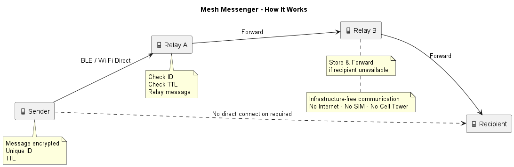

# Mesh Messenger

## Infrastructure-Free Peer-to-Peer Mesh Messaging

Mesh Messenger is an Android-based peer-to-peer messaging application designed to enable communication without relying on traditional network infrastructure such as cellular networks, internet service providers, or the internet.

Devices discover nearby peers using Bluetooth Low Energy (BLE) and Wi-Fi Direct/Nearby Connections and can relay messages across multiple devices to reach recipients that are outside the sender's direct range.

---

## The Problem

Communication systems often depend on centralized infrastructure such as cell towers and internet connectivity. During disasters, network shutdowns, remote-area connectivity issues, or heavily crowded events, this infrastructure may become unavailable or overloaded.

Mesh Messenger aims to allow nearby users to continue communicating by forming a local peer-to-peer mesh network.

---

## Our Solution

Mesh Messenger allows devices to:

- Discover nearby devices without internet connectivity
- Establish direct peer-to-peer connections
- Relay messages through intermediate devices
- Forward messages across multiple hops
- Prevent duplicate messages using unique message IDs
- Limit message propagation using TTL (Time To Live)
- Store messages temporarily when a recipient is unavailable
- Provide end-to-end encrypted communication

---

## How It Works



### Message Flow

```text
Sender
   |
   v
Device A
   |
   v
Device B
   |
   v
Device C
   |
   v
Recipient